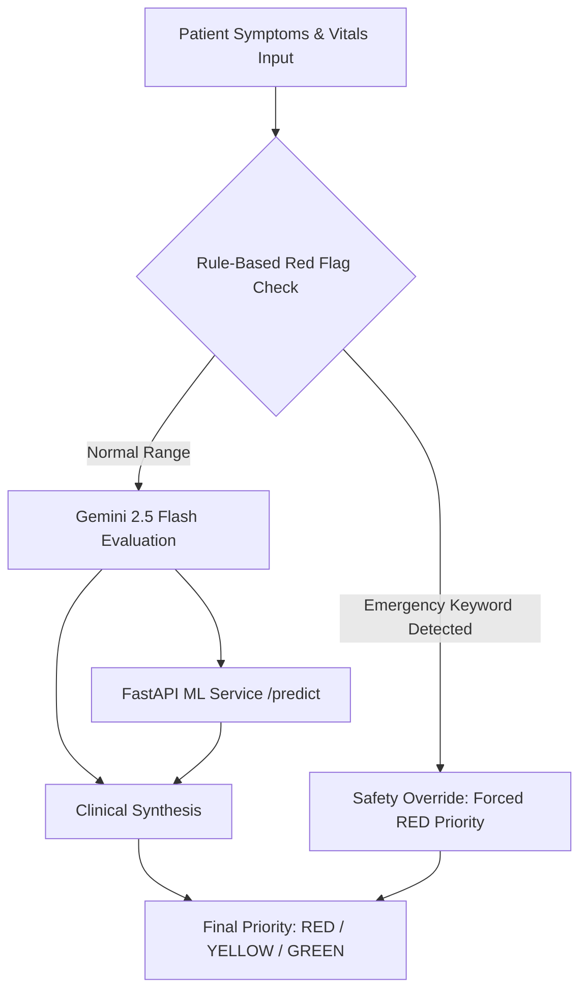

# Smart Digital OPD System — End-to-End Verification & Manual Testing Guide

A comprehensive testing manual for verifying all features, roles, workflows, machine learning models, Gemini AI triage, and real-time Socket.io communication in the Smart Digital OPD platform.

---

## 1. System Architecture & Component Ports

The system consists of three concurrently running applications and a database:

| Component | Technology | Default Port | Description |
| :--- | :--- | :--- | :--- |
| **Backend Express API** | Node.js, TypeScript, Express 5 | `http://localhost:5000` | REST API, Socket.io real-time server, RBAC |
| **ML Triage Microservice** | Python, FastAPI, Uvicorn, Scikit-learn | `http://localhost:8000` | PhysioNet MIMIC-IV-ED triage inference service |
| **Hospital Web Portal** | React 19, Vite, TanStack Router, Tailwind | `http://localhost:5173` | Staff intake, Clinician clinic, Admin portal |
| **Patient PWA App** | React 19, Vite, Tailwind, Workbox PWA | `http://localhost:5174` | Patient self-check-in, live token, indoor map |
| **Database & Auth** | Supabase (PostgreSQL + Auth + RLS) | Cloud / Local | Profiles, visits, queue tickets, clinical notes |

---

## 2. Prerequisites & Environment Setup

### 2.1 Database Migrations
Before starting, ensure all migrations are applied in your Supabase project (via Supabase SQL Editor):
1. `supabase/migrations/001_initial_schema.sql` (Core tables: profiles, patients, visits, symptoms, queue_tickets, alerts)
2. `supabase/migrations/002_map_and_consultation.sql` (Doctor departments, clinical records, map data, system settings)
3. `supabase/migrations/003_rls_policies.sql` (Role-based row level security policies)

### 2.2 Starting the Servers

#### Terminal 1 — Backend & ML Services (Concurrent)
```bash
cd server
npm run dev
```
> **Note**: This starts **both** the Express API (port 5000) and the FastAPI ML service (port 8000) simultaneously via `concurrently`.

#### Terminal 2 — Hospital Web (Staff / Doctor / Admin)
```bash
cd hospital-web
npm run dev
```
Accessible at: `http://localhost:5173`

#### Terminal 3 — Patient PWA
```bash
cd patient-pwa
npm run dev
```
Accessible at: `http://localhost:5174`

---

## 3. Test Accounts & Role Setup

The system enforces Role-Based Access Control (RBAC) across four roles:

| Role | Test Email | Password | Access Rights |
| :--- | :--- | :--- | :--- |
| **ADMIN** | `admin@opd.com` | `demo123` | Full access, user roles, doctor specializations, audit logs |
| **DOCTOR** | `doctor@opd.com` | `demo123` | Consultation workspace, multi-department queue, SOAP notes |
| **STAFF** | `staff@opd.com` | `demo123` | Walk-in registration, general queue management, alerts |
| **PATIENT** | `patient@opd.com` | `demo123` | Patient PWA, self-triage, live token tracking, indoor map |

> **Tip**: If logging in for the first time with a new email, the system automatically provisions the profile based on email convention (`admin.*` → ADMIN, `doctor.*` → DOCTOR, others → STAFF). Roles can also be modified in the Admin Portal.

---

## 4. Feature Testing by Role & Workflow

---

### Phase A: Hospital Administration & Configuration (Admin Role)

#### Objective
Verify user role modification, doctor multi-department specialization assignment, and the real-time security audit trail.

#### Test Steps
1. Navigate to `http://localhost:5173/login` and sign in as `admin@hospital.com`.
2. Notice the **ADMIN** badge next to the user name in the top header.
3. Click **"Admin Portal"** in the sidebar (route: `/staff/admin`).
4. **Test Tab 1: Doctor Specializations & Units**:
   - Locate doctor `doctor.cardio@hospital.com`.
   - Click **"Configure Units & Specializations"**.
   - Select multiple clinical departments (e.g., check both **"Cardiology"** and **"General Medicine"**).
   - Click **"Save Specializations"**.
   - Verify toast: *"Doctor department specializations assigned!"*.
5. **Test Tab 2: Role Management**:
   - Find any user in the staff directory.
   - Use the dropdown to promote or change their role (`STAFF` ↔ `DOCTOR` ↔ `ADMIN`).
   - Verify that changes persist immediately upon reload.
6. **Test Tab 3: Live Audit Trail**:
   - Switch to the **"Live Audit Trail"** tab.
   - Verify that actions such as `DOCTOR_DEPARTMENTS_ASSIGNED`, `USER_ROLE_UPDATED`, and `CONSULTATION_STARTED` appear with accurate actor, entity, and timestamp details.

---

### Phase B: Staff Reception & Walk-In Intake (Staff Role)

#### Objective
Verify patient registration, queue reassignment, priority calls, and emergency alert acknowledgement.

#### Test Steps
1. Sign in as `staff.reception@hospital.com` at `http://localhost:5173`.
2. **Test Walk-In Patient Registration**:
   - Click **"Patients"** → **"New Registration"** (`/staff/patients/new`).
   - Fill in:
     - Name: `Rahul Sharma`
     - Age: `42`, Gender: `Male`
     - Phone: `9876543210`
     - Department: `General Medicine`
     - Priority: `YELLOW`
     - Symptoms: `Persistent high fever, severe headache for 2 days`
   - Click **"Complete Registration & Issue Token"**.
   - Verify a new token (e.g. `A-102`) is generated and added to the queue.
3. **Test Live Queue Management (`/staff/queue`)**:
   - Filter by department dropdown (e.g., select *"General Medicine"*).
   - Verify sorting: `RED` priority patients stay at the top, followed by `YELLOW`, then `GREEN`.
   - Click **"Call Next"**:
     - Verify status switches to **CALLED**.
     - Verify the called row flashes visually.
     - Verify Socket.io event `queue:patient-called` is broadcast.
4. **Test Emergency Alerts (`/staff/alerts`)**:
   - When any patient is classified as `RED` priority, an alert banner appears with an urgent warning.
   - Click **"Acknowledge"** on the alert.
   - Verify it moves to the *"Acknowledged"* history section and updates the database.

---

### Phase C: Clinician Consultation Portal (Doctor Role)

#### Objective
Verify multi-department queue filtering for specialized doctors and end-to-end SOAP clinical documentation.

#### Test Steps
1. Sign in as `doctor.cardio@hospital.com` at `http://localhost:5173`.
2. Notice the **DOCTOR** badge in the header and click **"Consultations"** (`/staff/consultation`).
3. **Test Multi-Department Queue Filtering**:
   - Under the title, inspect the **"Assigned Units"** badges (e.g., `Cardiology`, `General Medicine`).
   - Verify that department filter buttons exist:
     - `All Assigned Units`
     - `Cardiology`
     - `General Medicine`
   - Toggle between filters: only patients belonging to those respective departments are displayed.
4. **Test Consultation Lifecycle**:
   - Select any waiting patient card from the left column.
   - Review patient demographic details and AI Triage assessment reasoning.
   - Click **"Start Consultation"**:
     - Status updates to `IN_CONSULTATION` / `IN_PROGRESS`.
     - Socket event `queue:status-updated` updates both Staff and Patient screens.
5. **Test SOAP Documentation**:
   - Fill in the encounter fields:
     - **(S) Subjective**: `Patient reports severe retrosternal pressure radiating to left arm.`
     - **(O) Objective**: `BP 145/95 mmHg, HR 98 bpm, lungs clear to auscultation.`
     - **(A) Assessment**: `Acute Angina Pectoris / Suspected NSTEMI`
     - **(P) Plan**: `Sublingual Nitroglycerin 0.4mg stat, 12-lead ECG, Aspirin 300mg.`
     - **Disposition**: Select `Admit to Inpatient / Ward` or `Follow-up Consultation`.
     - **Follow-up Date**: Choose a date next week.
   - Click **"Save SOAP Notes"**: Verify toast confirms saving to `clinical_records` table.
   - Click **"Complete Encounter"**:
     - Verify visit status updates to `COMPLETED`.
     - Queue ticket status is marked `COMPLETED`.
     - Form resets and the queue removes the completed patient.

---

### Phase D: Patient Self-Check-In & Mobile Care Journey (Patient PWA)

#### Objective
Verify the end-to-end patient journey on `http://localhost:5174` (open in mobile viewport / DevTools responsive mode).

#### Test Steps
1. Open `http://localhost:5174` and log in or register with `patient.test@gmail.com`.
2. **Test Symptom Intake (`/dashboard/symptoms`)**:
   - Click **"Start OPD Check-In"**.
   - Tap common symptom chips (e.g., *"Chest Discomfort"*, *"Shortness of Breath"*).
   - Test the voice input simulator by tapping the microphone icon.
   - Select Severity slider: Level 4 or 5.
   - Click **"Analyze Symptoms & Proceed"**.
3. **Test AI Triage Assessment Screen (`/dashboard/triage`)**:
   - Verify the loading indicator: *"Connecting to Gemini Triage Engine..."*.
   - Inspect the assessment card:
     - Priority badge (`RED`, `YELLOW`, or `GREEN`).
     - Gemini AI reasoning explanation.
     - Monitored safety red flags.
     - Recommended clinical department.
   - Click **"View Live Queue Token"**.
4. **Test Live Queue Token Tracking (`/dashboard`)**:
   - Verify the Hero Token Card displays:
     - Large token identifier (e.g., `A-103`).
     - Assigned department tag.
     - Real-time status indicator (`⏳ Waiting in Queue`, `🔔 Called to Room`, or `👨‍⚕️ In Consultation`).
     - Care Progress stepper showing current milestone.
5. **Test Real-Time Call Alert & Vibration**:
   - When the doctor or staff calls this token from the Hospital Web portal:
     - Patient card instantly turns into amber alert: **"Your Number Has Been Called!"**.
     - Device vibration fires (on supported mobile devices).
     - Stepper advances to "Proceed to Consultation Room".
6. **Test Indoor Hospital Navigation (`HospitalMapModal`)**:
   - On the dashboard, click **"View Hospital Indoor Map & Clinic Directions"**.
   - Verify the interactive modal displays:
     - Vector SVG floor map of OPD Wing A.
     - Room markers: Room 101 (Triage), Room 102 (Pharmacy), Room 103 (GP), Room 104 (Consultation Target).
     - Pulsing turquoise waypoint over Room 104.
     - Animated dashed walking path running from the Entrance / Waiting Lobby directly to Room 104.
     - Turn-by-turn walking directions at the bottom.
   - Toggle between **Floor 1 (OPD)** and **Floor 2 (Labs)**.
   - Close modal.
7. **Test Digital Health Records (`/dashboard/records`)**:
   - Click **"View Records"** or navigate to `/dashboard/records`.
   - Verify that past visits appear with date, department, and doctor notes.
   - Verify that diagnoses documented by the clinician in Phase C display under **"Clinical Assessment"**.

---

### Phase E: Kiosk Mode on Hospital Web (Touchscreen / Reception View)

#### Objective
Verify the self-service walk-in kiosk journey designed for hospital waiting rooms.

#### Test Steps
1. Navigate to `http://localhost:5173/` (Kiosk landing page).
2. Click **"Language / भाषा"**: test language selection.
3. Click **"Accessibility Options"**: toggle high contrast, large text, and reduced motion modes.
4. Click **"Start Walk-in Registration"**:
   - Option A: Test Document Scan simulation (pre-fills mock government ID/insurance).
   - Option B: Manual text entry.
5. Proceed through symptom questions and interactive chat triage.
6. Verify the final print screen displays the queue token, estimated wait time, and department instructions.

---

## 5. Triage AI Engine & Safety Verification

The OPD triage system uses a **triple-safety evaluation pipeline**:



### 5.1 Test Scenarios for Triage Verification

| Test Scenario | Test Input Symptoms | Expected AI Priority | Expected Safety Flags | Target Department |
| :--- | :--- | :--- | :--- | :--- |
| **Emergency (Cardiac)** | *"Sudden crushing chest pain, radiating to left arm, cold sweat, difficulty breathing"* | **RED** | Chest pain, cardiac warning, urgent intervention | Cardiology / Emergency |
| **Emergency (Neurological)** | *"Sudden facial drooping, weakness in right arm, slurred speech"* | **RED** | Stroke indicators, critical FAST protocol | Neurology / Emergency |
| **Urgent (Infectious/GI)** | *"High fever 103F for 2 days, persistent vomiting, severe abdominal cramps"* | **YELLOW** | Dehydration risk, acute abdomen | Internal Medicine |
| **Urgent (Trauma)** | *"Fell down stairs, severe swelling and deformity in right ankle, unable to bear weight"* | **YELLOW** | Suspected fracture, immobilization needed | Orthopedics |
| **Routine (General OPD)** | *"Mild dry cough, runny nose, slight throat irritation for 3 days, no fever"* | **GREEN** | None | General Medicine |

### 5.2 ML Service Direct API Verification (FastAPI)

To verify the standalone Python ML microservice, execute in PowerShell or terminal:

```bash
curl -X POST http://localhost:8000/predict \
  -H "Content-Type: application/json" \
  -d '{
    "chief_complaint": "chest pain and shortness of breath",
    "heartrate": 115,
    "sbp": 85,
    "dbp": 55,
    "o2sat": 89,
    "temperature": 99.2,
    "pain": 8
  }'
```

**Expected Response**:
```json
{
  "ml_priority": "RED",
  "final_priority": "RED",
  "confidence": 0.94,
  "safety_override": true,
  "reasons": [
    "Safety rule: Critically low oxygen saturation (<90%)",
    "Safety rule: Hypotension detected (SBP < 90)",
    "Chief complaint contains critical keyword: chest pain"
  ]
}
```

---

## 6. End-to-End Multi-Window Integration Test (The Golden Flow)

To experience the full power of the real-time system, perform this 3-window synchronized test:

1. **Window 1 (Left Half)**: Open `http://localhost:5174` (Patient PWA, mobile view, logged in as `patient.test@gmail.com`).
2. **Window 2 (Top Right)**: Open `http://localhost:5173/staff/queue` (Staff Reception, logged in as `staff.reception@hospital.com`).
3. **Window 3 (Bottom Right)**: Open `http://localhost:5173/staff/consultation` (Doctor Portal, logged in as `doctor.cardio@hospital.com`).

### Observation Checklist:
1. **Submit symptoms in Window 1**:
   - Submit a cardiac symptom check-in.
   - **Observe Window 2 & Window 3**: The moment the assessment finishes, the new token appears in both staff and doctor queues without refreshing!
2. **Emergency Alert Trigger**:
   - Because it is `RED`, an emergency alert pops up in Window 2.
3. **Doctor calls patient in Window 3**:
   - In Window 3, doctor clicks *"Start Consultation"*.
   - **Observe Window 1 (Patient)**: The patient's token card immediately transitions to *"In Consultation"* status.
4. **Doctor completes encounter in Window 3**:
   - Clinician enters diagnosis *"Unstable Angina"*, sets disposition, and clicks *"Complete Encounter"*.
   - **Observe Window 1 (Patient)**: Go to *"Records"*, the new clinical encounter and diagnosis appear immediately in their medical history.

---

## 7. Verification Checklist Summary

- [x] Backend Express server compiles cleanly (`npm run build` exits 0).
- [x] Hospital Web compiles cleanly with all routes included (`npm run build` exits 0).
- [x] Patient PWA compiles cleanly with service worker generation (`npm run build` exits 0).
- [x] Python FastAPI ML service imports and serves predictions on port 8000.
- [x] Socket.io authenticated rooms function for role-based real-time delivery.
- [x] Multi-department specialized doctors view unified department queues.
- [x] SOAP documentation saves clinical records and updates patient history.
- [x] Hospital indoor vector map displays walking directions and waypoint guidance.
- [x] Triage rule-based safety overrides trigger on critical red-flag complaints.
